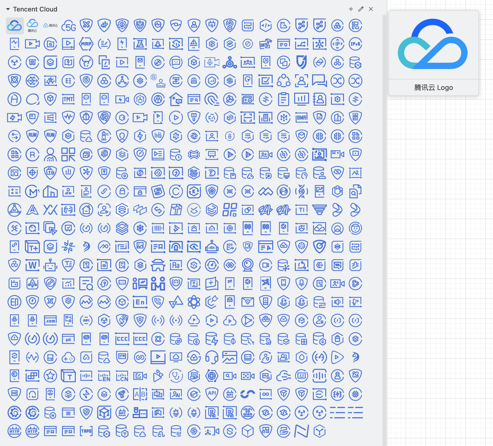

<p align="right">
    <a href="./README.md">中文</a> | <strong>English</strong>
</p>

## Tencent Cloud Official Vector Icons and draw.io Custom Libraries

### Background

In many well-known diagramming software (such as draw.io, Lucidchart, Gliffy etc.), there is no built-in Tencent Cloud official vector icons.
So I collected a complete set of Tencent Cloud vector icons and generated the draw.io icon library.

### Screenshot of draw.io Custom library Icons



### Download draw.io Custom Library

<a href="2024-blue/drawio/cn/Tencent%20Cloud.xml">Chinese Version Tencent Cloud.xml</a> | <a href="2024-blue/drawio/en/Tencent%20Cloud.xml">English Version Tencent Cloud.xml</a>

### Sources of Tencent Cloud Vector Icons

Links: [Tencent Cloud Design Center](https://cloud.tencent.com/act/event/icons) | [Categories of Tencent Cloud Products](https://www.tencentcloud.com/product)

Color Code: `#0052D9`

### Related Tools

- [icon-organizer](./skills/icon-organizer/) - Automatically organize cloud product icon files into categorized folders

### Order of Icons in draw.io

```
.
├── 00 Logo (3)
├── 01 Compute (27)
├── 02 Container And Middleware (32)
├── 03 Storage (26)
├── 04 Tencentdb (28)
├── 05 Network (17)
├── 06 Cdn And Cloud Communication (7)
├── 07 Video (36)
├── 08 Security (75)
├── 09 Bigdata (18)
├── 10 Artificial Intelligence And Machine Learning (23)
├── 11 Development And Operation (45)
├── 12 Enterprise And Communication (27)
├── 13 Office Collaboration (14)
├── 14 Wechat Ecosystem (8)
├── 15 Internet Of Things (7)
├── 16 Industry (41)
└── 17 Service Marketing (24)
```
