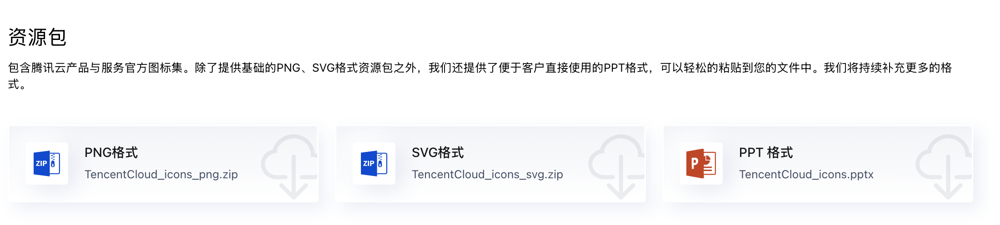

<p align="right">
    <strong>中文</strong> | <a href="./README.en.md">English</a>
</p>

## 腾讯云官方矢量图标和 draw.io 自定义图标库

### 背景

在众多知名的绘图软件（如draw.io、Lucidchart、Gliffy等）中都没有内置一套完整的、最新的腾讯云官方矢量图标。
因此，在画腾讯云相关的网络拓扑图和架构图时，和阿里云、AWS、Azure、GCP相比，很不方便。
于是，我收集整理了一套完整的腾讯云矢量图标，分别标注了中英文名称，并生成了相应的draw.io图标库，方便自己的同时也希望能够帮助到大家。

### draw.io 自定义图标库截图


### draw.io 自定义库下载

<a href="2024-blue/drawio/cn/Tencent%20Cloud.xml">中文版 Tencent Cloud.xml</a> ｜ <a href="2024-blue/drawio/en/Tencent%20Cloud.xml">英文版 Tencent Cloud.xml</a>

### 腾讯云矢量图来源

链接: [腾讯云设计中心](https://cloud.tencent.com/act/event/icons) | [腾讯云产品类别](https://cloud.tencent.com/document/product)

矢量图标颜色代码: `#0052D9`

### 相关工具

- [icon-organizer](./skills/icon-organizer/) - 自动整理云产品图标文件到分类目录的工具

---

## 🛠️ 更新图标库教程

当腾讯云官方更新了产品图标后，可以按照以下步骤更新本仓库的图标库：

### 步骤 1：下载最新资源包

1. 访问腾讯云设计中心：https://cloud.tencent.com/act/event/icons
2. 下载最新资源包（PNG、SVG、PPT 三种格式的 ZIP 文件）



### 步骤 2：解压文件到测试目录

将下载的 ZIP 文件解压到测试目录：

```bash
# 创建测试目录
mkdir -p test/tencent_cloud_product_icons

# 将下载的文件移动到测试目录并解压
cd test/tencent_cloud_product_icons
unzip tencent_cloud_product_icons_svg.zip
unzip tencent_cloud_product_icons_png.zip
unzip tencent_cloud_product_icons_ppt.zip
# PPT 文件也放在这个目录
```

解压后目录结构应该如下：

```
test/tencent_cloud_product_icons/
├── tencent_cloud_product_icons_zh.pptx
├── tencent_cloud_product_icons_en.pptx
├── tencent_cloud_product_icons_svg/
│   ├── zh/
│   │   └── *.svg (中文图标)
│   └── en/
│       └── *.svg (英文图标)
└── tencent_cloud_product_icons_png/
    ├── zh/
    │   └── *.png (中文图标)
    └── en/
        └── *.png (英文图标)
```

### 步骤 3：使用 icon-organizer Skill 整理图标

使用以下提示词调用 icon-organizer 技能来整理图标【🔥推荐】：

```
测试一下技能 icon-organizer，解析 tencent_cloud_product_icons_en.pptx，
并且把 icons 目录做一个整理：
- tencent_cloud_product_icons_svg
- tencent_cloud_product_icons_png
```

或者手动运行脚本：

```bash
# 进入 skill 目录
cd .codebuddy/skills/icon-organizer

# 整理中文 SVG 图标
python3 scripts/organize_icons.py \
  --icons-dir /path/to/tencent_cloud_product_icons_svg/zh \
  --language zh

# 整理英文 SVG 图标
python3 scripts/organize_icons.py \
  --icons-dir /path/to/tencent_cloud_product_icons_svg/en \
  --language en

# 整理中文 PNG 图标
python3 scripts/organize_icons.py \
  --icons-dir /path/to/tencent_cloud_product_icons_png/zh \
  --language zh

# 整理英文 PNG 图标
python3 scripts/organize_icons.py \
  --icons-dir /path/to/tencent_cloud_product_icons_png/en \
  --language en
```

### 步骤 4：验证整理结果

整理完成后，图标会按照以下 17 个分类进行组织：

| #  | 中文分类           | 英文分类                                     |
| -- | ------------------ | -------------------------------------------- |
| 01 | 计算               | Compute                                      |
| 02 | 容器与中间件       | Container And Middleware                     |
| 03 | 存储               | Storage                                      |
| 04 | 数据库             | Tencentdb                                    |
| 05 | 网络               | Network                                      |
| 06 | CDN与边缘          | Cdn And Cloud Communication                  |
| 07 | 视频服务           | Video                                        |
| 08 | 安全               | Security                                     |
| 09 | 大数据             | Bigdata                                      |
| 10 | 人工智能与机器学习 | Artificial Intelligence And Machine Learning |
| 11 | 开发与运维         | Development And Operation                    |
| 12 | 云通信与企业服务   | Enterprise And Communication                 |
| 13 | 办公协同           | Office Collaboration                         |
| 14 | 微信生态           | Wechat Ecosystem                             |
| 15 | 物联网             | Internet Of Things                           |
| 16 | 行业应用           | Industry                                     |
| 17 | 服务与营销         | Service Marketing                            |

### 步骤 5：处理未匹配的图标

如果有图标未能自动匹配到分类，需要更新 `icon-organizer` 技能中的分类映射：

1. 查看脚本输出的 "Remaining files" 列表
2. 编辑 `.codebuddy/skills/icon-organizer/scripts/organize_icons.py`
3. 在 `TENCENT_CLOUD_CATEGORIES_ZH` 或 `TENCENT_CLOUD_CATEGORIES_EN` 字典中添加新的产品名称

---

### draw.io 中图标的顺序

```
.
├── 00 Logo (3)
├── 01 计算 (27)
├── 02 容器与中间件 (32)
├── 03 存储 (26)
├── 04 数据库 (28)
├── 05 网络 (17)
├── 06 CDN与边缘 (7)
├── 07 视频服务 (36)
├── 08 安全 (75)
├── 09 大数据 (18)
├── 10 人工智能与机器学习 (23)
├── 11 开发与运维 (45)
├── 12 云通信与企业服务 (27)
├── 13 办公协同 (14)
├── 14 微信生态 (8)
├── 15 物联网 (7)
├── 16 行业应用 (41)
└── 17 服务与营销 (24)
```
